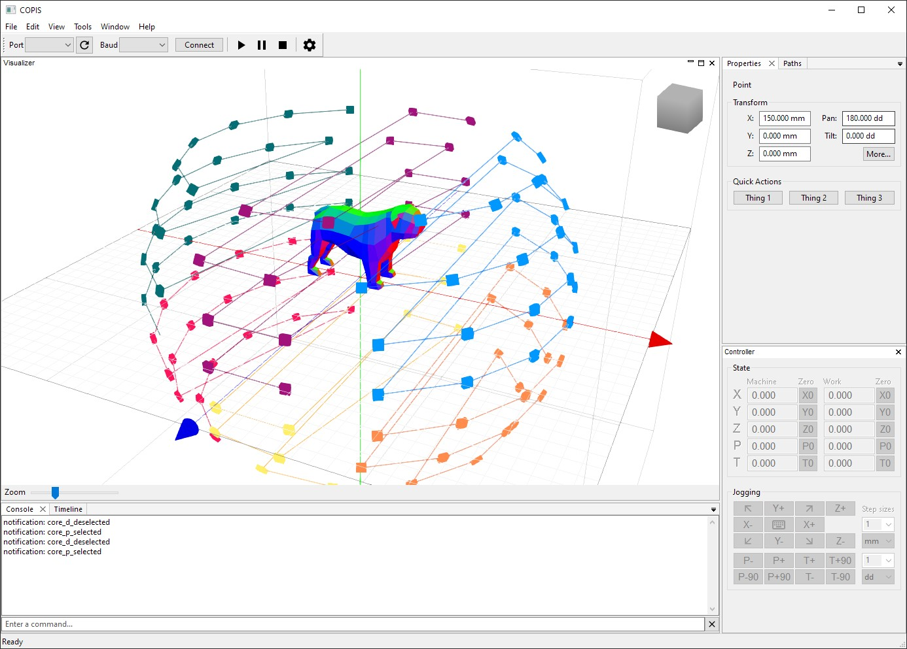

# COPIS

COPIS (Computer-Operated Photogrammetric Imaging System) is a desktop application which captures large numbers of overlapping images from multiple viewpoints around an object for photogrammetric 3D reconstruction.

For more information, see the project page at [copis3d.org](http://copis3d.org/).



## Getting Started

### Installation

Use the package manager [pip](https://pip.pypa.io/en/stable/) to install any necessary project dependencies.

```bash
pip install -r requirements.txt
```

If you have both Python 2.x and 3.x versions installed, you may need to specify:

```bash
python3 -m pip install -r requirements.txt
```

### Usage

Run `./copis.py` to start the application.

### Configuration File

The configuration file `copis.ini` contains settings for initialization.

## License

COPISClient as a whole is licensed under the GNU General Public License, Version 3. Please note that files where it is difficult to state this license note (such as images) are distributed under the same terms.

Credit to some parts of the source code go to [Printrun](https://github.com/kliment/Printrun) and [PrusaSlicer](https://github.com/prusa3d/PrusaSlicer).
